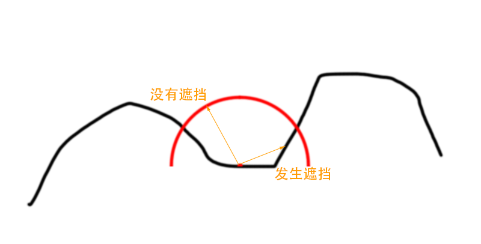
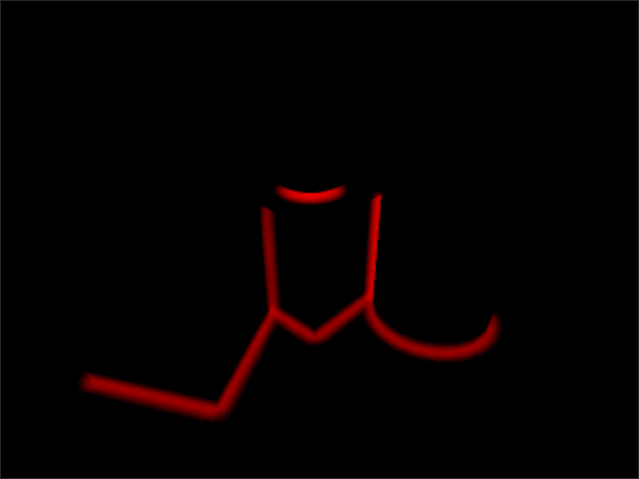
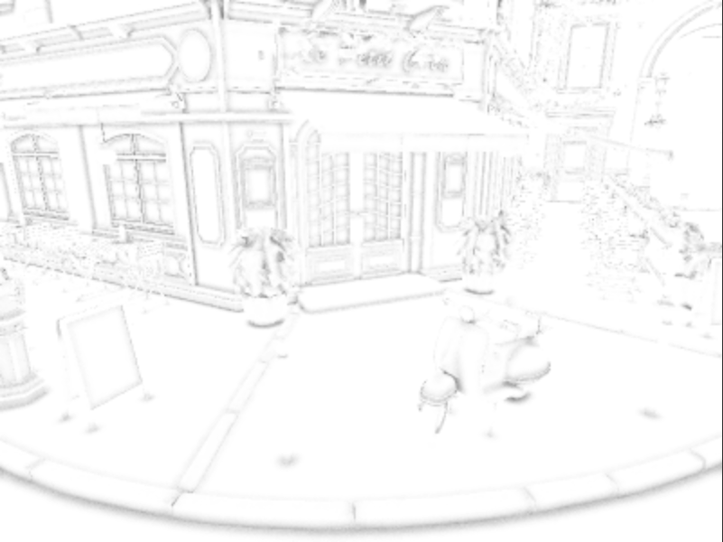

Ray Tracing Ambient Occlusion by Unity 2019.3
=========================================

Version 1.0, 2019-Nov-4
<br/>
Copyright 2019. ZHing. All rights received.
<br/>

- [Ray Tracing Ambient Occlusion by Unity 2019.3](#ray-tracing-ambient-occlusion-by-unity-20193)
- [1. 综述](#1-%e7%bb%bc%e8%bf%b0)
- [2. 计算AO](#2-%e8%ae%a1%e7%ae%97ao)
  - [2.1. Ray Trace Shader](#21-ray-trace-shader)
  - [2.2. 生成的AO信息](#22-%e7%94%9f%e6%88%90%e7%9a%84ao%e4%bf%a1%e6%81%af)
  - [2.3. 为什么使用GBuffer？](#23-%e4%b8%ba%e4%bb%80%e4%b9%88%e4%bd%bf%e7%94%a8gbuffer)
  - [2.4. 随机数](#24-%e9%9a%8f%e6%9c%ba%e6%95%b0)
  - [2.5. Denoise](#25-denoise)
  - [2.6. Render Pipeline](#26-render-pipeline)
- [3. 最终结果](#3-%e6%9c%80%e7%bb%88%e7%bb%93%e6%9e%9c)
- [4. 源码工程](#4-%e6%ba%90%e7%a0%81%e5%b7%a5%e7%a8%8b)

# 1. 综述
本文讲述在Unity 2019.3中，利用DXR实现Realtime Ambient Occlusion的一个案例。Ambient Occlusion以下简称AO。利用Ray Tracing实现AO非常简单可谓是Ray Tracing Realtime应用的Hello World.


# 2. 计算AO
计算AO的方法非常简单，基于物体表面的一点，沿法线建立半球，在半球中按cos分布随机发射光线采样周围指定半径。如果光线被阻挡则计入AO值，没有被阻挡则不计入AO值。



## 2.1. Ray Trace Shader

```glsl
for (int i = 0; i < MAX_SAMPLES; ++i)
{
  const uint2 noiseCoord = uint2((currentPixelCoord.x + i) % 256, (currentPixelCoord.y + i * i) % 256);
  float3 positionWS = GetWorldPositionByPixelCoordAndDepth(currentPixelCoord, normalAndDepth.w);
  float3 normalWS = normalAndDepth.xyz;
  float3 directionWS = SampleHemisphereCosine(_NoiseTexture[noiseCoord].xy, normalWS);

  RayDesc rayDescriptor;
  rayDescriptor.Origin = positionWS - 1e-4f * normalWS;
  rayDescriptor.Direction = directionWS;
  rayDescriptor.TMin = 1e-5f;
  rayDescriptor.TMax = 0.075f;

  RayIntersectionAO rayIntersection;
  rayIntersection.ao = 0.0f;

  TraceRay(_AccelerationStructure, RAY_FLAG_CULL_BACK_FACING_TRIANGLES, 0xFF, 0, 1, 0, rayDescriptor, rayIntersection);
  finalValue += rayIntersection.ao;
}
finalValue /= MAX_SAMPLES;
```
首先通过获取世界空间中的位置和法线信息。

**SampleHemisphereCosine**：根据噪声贴图产生的随机数在以normalWS定义的半球中随机产生cos分布的矢量*directionWS*。

**rayDescriptor.Origin = positionWS - 1e-4f * normalWS**：rayDescriptor.Origin向物体内部偏移了一小段距离，可以减少Ray Tracing检测这档时的误差。

**TraceRay** 的返回值（1：被遮挡。0：没遮挡）。

```glsl
[shader("miss")]
void MissShader(inout RayIntersectionAO rayIntersection : SV_RayPayload)
{
  rayIntersection.ao = 0.0f;
}
```
**miss shader** 没有被遮挡返回0。

```glsl
[shader("closesthit")]
void ClosestHitShader(inout RayIntersectionAO rayIntersection : SV_RayPayload, AttributeData attributeData : SV_IntersectionAttributes)
{
  rayIntersection.ao = 1.0f;
}
```
**closesthit shader** 物体的材质被遮挡返回1。

## 2.2. 生成的AO信息


渲染目标为 *GraphicsFormat.R16_SFloat* 格式，因此显示为红色。

## 2.3. 为什么使用GBuffer？
为什么使用GBuffer，而不使用Ray Tracing获取世界空间中的Position和Normal？

Realtime下使用Ray Tracing最重要的优化就是尽可能的少发射光线，并且一般都会和Rasterization共同使用。因此利用Rasterization阶段已经计算好的GBuffer将可以减少发射光线的数量。

## 2.4. 随机数
本文所实现的随机采样都使用了预先生成好的Blue Noise贴图，Blue Noise和使用White Noise随机采样相比，更适合Tiling同时能更高效的收敛。关于Blue Noise的论述已超出了本文的论述范畴。详细论述可以参看[Bilateral Blue Noise Sampling](http://www.cs.columbia.edu/~fyun/bluenoise/final_opt.pdf)、[Blue-noise dithered sampling](https://dl.acm.org/citation.cfm?id=2927430)和[噪声的颜色](https://en.wikipedia.org/wiki/Colors_of_noise)。

## 2.5. Denoise
由于在Ray Tracing阶段为了减少采样，因此最终结果会充满了Noise。因此需要对Ray Tracing的结果进行Denoise处理。Denoise不论在Realtime还是Offline Ray Tracing中都至关重要，好的Denoise处理能大大减少进行的Ray Tracing采样数量，加快渲染时间。近年来ML的兴起也被应用到了Denoise上，参看[NVIDIA® OptiX™ AI-Accelerated Denoiser](https://developer.nvidia.com/optix-denoiser)、[AMD Radeon™ ProRender
](https://radeon-pro.github.io/RadeonProRenderDocs/rif/filters/ai_denoiser.html)和[Intel® Open Image Denoise](https://openimagedenoise.github.io/)。

本文论述重点是Ray Tracing AO，Denoise并不在本文论述范畴，Denoise展开了讲估计一本书也说不完。。。有兴趣可以参看[GDC2019 Real-Time Path Tracing and Denoising in 'Quake 2'](https://www.gdcvault.com/play/1026185/Real-Time-Path-Tracing-and)。

Denoise的结果



## 2.6. Render Pipeline
```csharp
using (new ProfilingSample(cmd, "GBuffer"))
{
  cmd.SetViewProjectionMatrices(camera.worldToCameraMatrix, projectionMatrix);
  cmd.SetRenderTarget(gBuffer, outputDepth);
  cmd.ClearRenderTarget(true, false, Color.black);
  foreach (var renderer in SceneManager.Instance.renderers)
  {
    for (var subMeshIndex = 0; subMeshIndex < renderer.sharedMaterials.Length; ++subMeshIndex)
      cmd.DrawRenderer(renderer, renderer.sharedMaterial, subMeshIndex, renderer.sharedMaterial.FindPass("GBuffer"));
  }
}

context.ExecuteCommandBuffer(cmd);
cmd.Clear();

using (new ProfilingSample(cmd, "RayTracing"))
{
  cmd.SetRayTracingShaderPass(_shader, "RayTracing");
  cmd.SetRayTracingAccelerationStructure(_shader, _pipeline.accelerationStructureShaderId, accelerationStructure);
  cmd.SetRayTracingTextureParam(_shader, _NoiseTextureShaderId, _noiseTexture);
  cmd.SetRayTracingTextureParam(_shader, _GBufferShaderId, gBuffer);
  cmd.SetRayTracingTextureParam(_shader, _outputTargetShaderId, outputTarget);
  cmd.SetRayTracingVectorParam(_shader, _outputTargetSizeShaderId, outputTargetSize);
  cmd.DispatchRays(_shader, "AmbientOcclusionGenShader", (uint) outputTarget.rt.width,
    (uint) outputTarget.rt.height, 1, camera);
}

context.ExecuteCommandBuffer(cmd);
cmd.Clear();

using (new ProfilingSample(cmd, "Denoise"))
{
  const int areaTileSize = 8;
  var numTilesX = (intermediateBuffer.rt.width + (areaTileSize - 1)) / areaTileSize;
  var numTilesY = (intermediateBuffer.rt.height + (areaTileSize - 1)) / areaTileSize;
  cmd.SetComputeTextureParam(denoiser, _BilateralFilterKernelId, _NoiseTextureShaderId, _noiseTexture);
  cmd.SetComputeTextureParam(denoiser, _BilateralFilterKernelId, _GBufferShaderId, gBuffer);
  cmd.SetComputeTextureParam(denoiser, _BilateralFilterKernelId, _DenoiseInputShaderId, outputTarget);
  cmd.SetComputeVectorParam(denoiser, _outputTargetSizeShaderId, outputTargetSize);
  cmd.SetComputeTextureParam(denoiser, _BilateralFilterKernelId, _DenoiseOutputRWShaderId, intermediateBuffer);
  cmd.SetComputeFloatParam(denoiser, _DenoiserFilterRadiusShaderId, 0.1f);
  cmd.DispatchCompute(denoiser, _BilateralFilterKernelId, numTilesX, numTilesY, 1);

  numTilesX = (AOTexture.rt.width + (areaTileSize - 1)) / areaTileSize;
  numTilesY = (AOTexture.rt.height + (areaTileSize - 1)) / areaTileSize;
  cmd.SetComputeTextureParam(denoiser, _GatherKernelId, _DenoiseInputShaderId, intermediateBuffer);
  cmd.SetComputeTextureParam(denoiser, _GatherKernelId, _DenoiseOutputRWShaderId, AOTexture);
  cmd.DispatchCompute(denoiser, _GatherKernelId, numTilesX, numTilesY, 1);
}

context.ExecuteCommandBuffer(cmd);
cmd.Clear();

using (new ProfilingSample(cmd, "FinalBlit"))
{
  cmd.SetGlobalTexture(_GBufferShaderId, gBuffer);
  cmd.Blit(AOTexture, BuiltinRenderTextureType.CameraTarget, _finalBlitMat);
}
```
代码结构非常的清晰明了：GBuffer->RayTracingAO->Denoise->FinalCompose

# 3. 最终结果
没有AO


AO信息



最终合成


# 4. 源码工程
[https://github.com/zhing2006/RayTracingAO](https://github.com/zhing2006/RayTracingAO)
